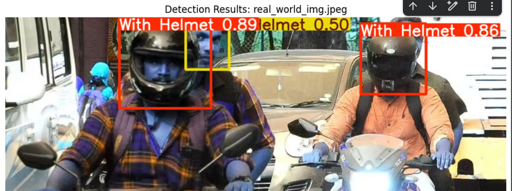
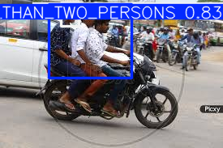

# Traffic VDS — Traffic Violation Detection System

AI-based traffic violation detection and challan management system using Computer Vision and Deep Learning.

The system detects traffic violations from images/videos, recognizes vehicle number plates, and supports automatic challan generation and management through a role-based dashboard.

## 🚀 Live Demo

**Railway:**
https://trafficvds-production.up.railway.app

## ✨ Features

* Helmet violation detection
* Triple-riding detection
* Mobile phone usage detection
* Vehicle number-plate detection
* Number plate recognition using OCR
* Automatic challan generation
* Challan history and status management
* Traffic rules management
* Super Admin and Sub Admin roles
* Image and video-based detection
* Dashboard for violation monitoring

## 🛠️ Tech Stack

| Component            | Technology                     |
| -------------------- | ------------------------------ |
| Frontend             | Streamlit                      |
| Backend              | FastAPI                        |
| Object Detection     | YOLOv8 (Ultralytics)           |
| OCR                  | EasyOCR                        |
| Computer Vision      | OpenCV                         |
| Database             | Supabase / PostgreSQL          |
| Programming Language | Python                         |
| Model Training       | Google Colab + NVIDIA Tesla T4 |
| Dataset Management   | Roboflow                       |

## 📊 Model Performance

| Module                       |       Performance |
| ---------------------------- | ----------------: |
| Helmet Detection             | **92.72% mAP@50** |
| Triple Riding / Mobile Usage | **88.11% mAP@50** |
| Number Plate Detection       | **~85% Accuracy** |
| OCR Recognition              | **~85% Accuracy** |

### Helmet Detection

* mAP@50: **92.72%**
* mAP@50–95: **70.90%**
* Precision: **87.78%**
* Recall: **89.59%**

### Triple Riding / Mobile Usage Detection

* mAP@50: **88.11%**
* mAP@50–95: **51.49%**
* Precision: **83.40%**
* Recall: **81.70%**

> These values are the evaluation results reported in the project report and should not be interpreted as guaranteed real-world accuracy.

## 🔄 System Workflow

```text
Image / Video
      ↓
YOLOv8 Violation Detection
      ↓
Number Plate Detection
      ↓
EasyOCR Number Plate Recognition
      ↓
FastAPI Processing
      ↓
Challan Generation
      ↓
Dashboard & Records
```

## 🖼️ Screenshots

### Super Admin Dashboard

[](https://github.com/nidhi-singh28/Traffic_Violation_Detection_System/blob/main/super%20admin%20dashboard.jpeg)

### Sub Admin Dashboard

[](https://github.com/nidhi-singh28/Traffic_Violation_Detection_System/blob/main/sub%20admin%20dashboard.jpeg)

### Helmet Detection

[](https://github.com/nidhi-singh28/Traffic_Violation_Detection_System/blob/main/helmet%20detection.jpeg)

### Helmet Detection — Additional Result

[](https://github.com/nidhi-singh28/Traffic_Violation_Detection_System/blob/main/helmet_det_3.jpeg)

### Triple Riding Detection

[](https://github.com/nidhi-singh28/Traffic_Violation_Detection_System/blob/main/triple%20riding%20detection.jpeg)

### Triple Riding Detection — Additional Result

[](https://github.com/nidhi-singh28/Traffic_Violation_Detection_System/blob/main/triple_riding_detec.png)

### Number Plate Recognition

[](https://github.com/nidhi-singh28/Traffic_Violation_Detection_System/blob/main/number%20plate%20recognition.jpeg)

### Generated Challan

[](https://github.com/nidhi-singh28/Traffic_Violation_Detection_System/blob/main/chllan%20generate.jpeg)

### Challan History

[](https://github.com/nidhi-singh28/Traffic_Violation_Detection_System/blob/main/challan%20history.jpeg)

## 🎥 Helmet Detection Demo

A Helmet Detection video is also included in the project demonstration.

**Live Demo:**
https://trafficvds-production.up.railway.app

## 👥 Role-Based Access

### Super Admin

* Manage Sub Admin accounts
* Create and manage traffic rules
* Perform image/video violation detection
* View complete challan history
* Update challan amount
* Change challan status
* Monitor system activities

### Sub Admin

* Perform image/video violation detection
* Generate challans
* View traffic rules
* Access personal detection and violation records

## 🔮 Future Scope

* Night-time traffic detection
* Speed violation detection
* Live CCTV integration
* Real-time video processing
* RTO/vehicle database integration
* Automated SMS/email notifications
* Mobile application
* Large-scale cloud deployment

## 📌 Project Note

This project was developed for academic and portfolio demonstration purposes and demonstrates the practical application of Computer Vision, Deep Learning, OCR, APIs, databases and web technologies for intelligent traffic monitoring.

The public repository contains a demo-safe version and does not expose private credentials, production database configuration or trained model weights.
